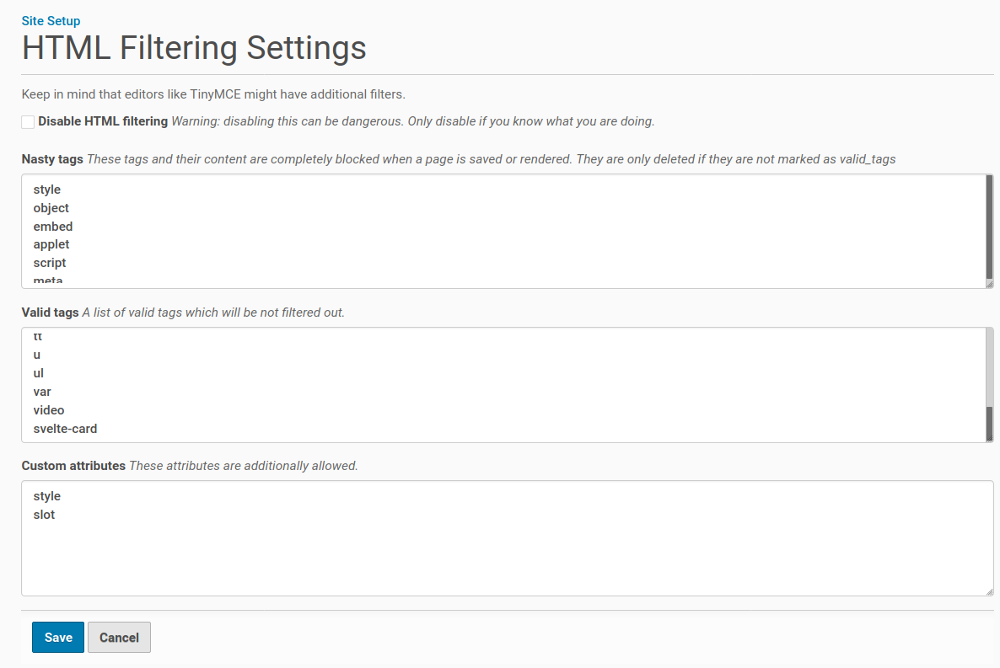
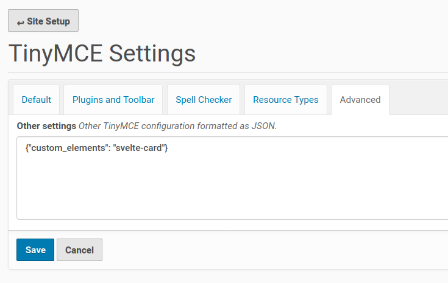

=======================
Svelte app sub-template
=======================

.. topic:: Description

    Adding a Svelte app to an existing add-on package.

With this sub-template, you can add modern `Svelte <https://svelte.dev>`_ app's and/or `custom elements <https://developer.mozilla.org/en-US/docs/Web/Web_Components/Using_custom_elements>`_ ak *web components* to a Plone package.

First create a Plone add-on package:

.. code-block:: shell

    mrbob -O collective.svelteapps bobtemplates.plone:addon

then change into the created folder ``collective.svelteapps``:

.. code-block:: shell

    mrbob bobtemplates.plone:svelte_app

It will ask you about the name of your app and if  you want Svelte to generate  custom element instead of a native Svelte app.
This will generate the structure of your app and also register the bundles inside the Plone package.

Mainly it creates a folder for the Svelte src in ./svelte_src/<my_svelte_app>.
Inside this folder you have to run:

.. code-block:: shell

    npm install

and then to build the app bundles from the src:

.. code-block:: shell

    npm run build

This will build you bundles and put them into the output folder, which is inside of your Plone package in svelte_apps/<my_svelte_app>.
From here it will be loaded into Plone by the resource registry.

For development you can also run:

.. code-block:: shell

    npm run dev

This will watch the src folder and update the bundles after every change.
In the Plone HTML filter control panel, you have to make sure that your custom element (tag) is in the list of valid tags.
If you are not using custom element support, you can also change the target selector in the main.js to select based on CSS id's or classes and use a div tag with that class to activate the app.

To activate the app in Plone, you can put either the custom element for example my-custom-element inside any html, even with the TinyMCE source code mode.

.. code-block:: xml

    <h1>Heading in your Plone page</h1>
    <my-custom-element></my-custom-element>
    
Some more static content of the Plone page.

or in case of a nativ Svelte app, which uses a CSS class "my-custom-element" to activate the app, you can include it like this:

.. code-block:: xml

    <h1>Heading in your Plone page</h1>
    

    
Some more static content of the Plone page.

Necessary settings in Plone
===========================

If you are using custom-elements there some settings, to make so that you can use theme in TinyMCE.

In the HTML filter, you want to add the name of your custom element, for example svelte-card to the list of allowed tags.

We also added the slot attribute to the custom attrbitures list, so that we can use it in our custom elements.

.. code-block:: xml

    <h1>Heading in your Plone page</h1>

    <svelte-card>
      Svelte Card
      
Svelte is nice! This custom element has no dependencies, is very small and works in any modern Browser and most JS Frameworks.

    </svelte-card>

    
Some more static content of the Plone page.

The code above needs us to add some settings to TinyMCE.

You could do this also via registry settings in you profiles:

.. code-block:: xml

    <?xml version='1.0' encoding='UTF-8'?>
    <registry>
    <records interface="Products.CMFPlone.interfaces.controlpanel.ITinyMCESchema" prefix="plone">
        <value key="other_settings" purge="false">{"custom_elements": "svelte-card"}</value>
    </records>
    </registry>

Optimizing
==========

By default all apps are enabled and loaded by default. This makes it easy for you to start, but can lead to too much resources loaded, even if they don't needed at the moment.
To optimize this, you can change the *enabled* setting in the registry: profiles/default/registry/rreg-<your_svelte_app_name>.xml.
If you set the *enabled* setting to False, Plone will not load the resources files globally. Instead you can include them by your self where you need it.

For example, you could have a Plone BrowserView which renders the app and also enables the resources just for this view.
For more infos on how to enable resources on demand, have a look in the docs here:
https://docs.plone.org/adapt-and-extend/theming/resourceregistry.html#controlling-resource-and-bundle-rendering

Another way to include them is to simply add them in a page template with the fill-slot command and inject it into the header.
